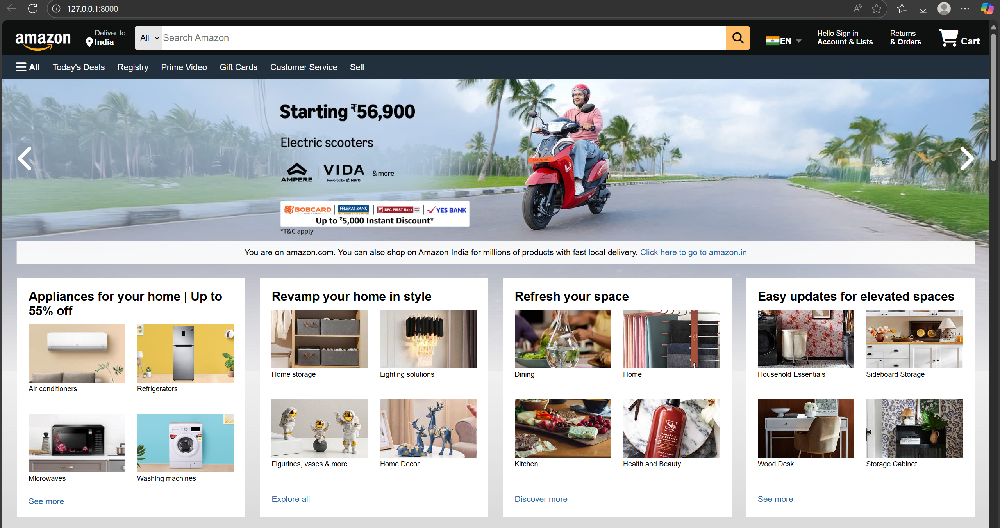
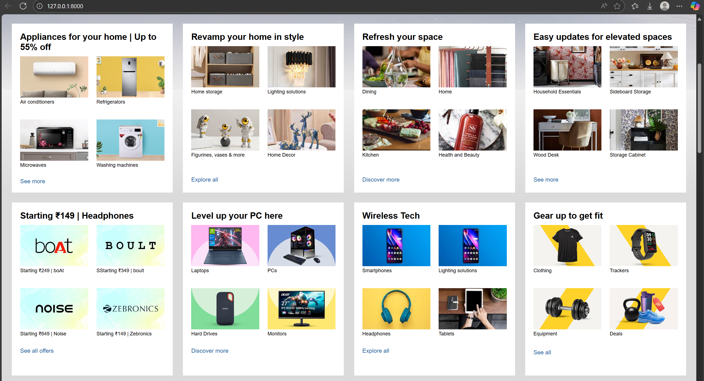
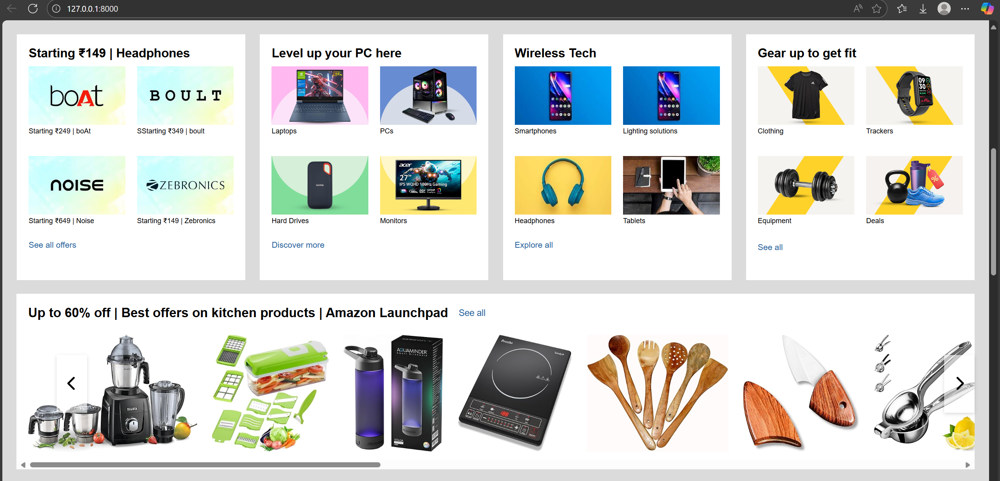
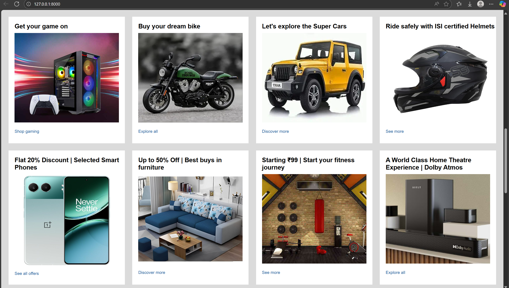
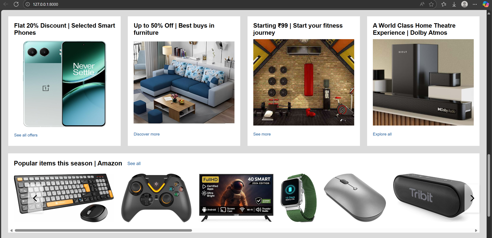
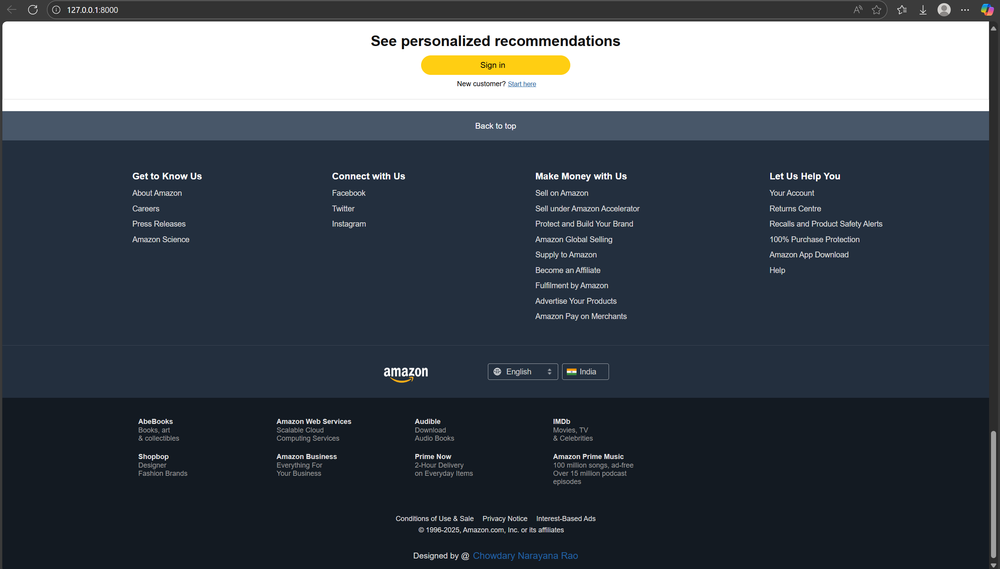

# 🛍️ Amazon Clone – Responsive Front-End Web UI  
**Built with Python, Django, HTML, CSS, JavaScript**

A fully responsive homepage modeled after Amazon India, featuring dynamic product categories, promotional banners, and a professional footer. This project highlights full-stack development, clean UI structure, and recruiter-ready polish.

---

## 🧭 Table of Contents

- [✨ Key Features](#-key-features)
- [📸 Screenshots](#-screenshots)
- [🛠️ Tech Stack](#-tech-stack)
- [📦 Setup Instructions](#%EF%B8%8F-setup-instructions)
- [🙋‍♂️ About Me](#%EF%B8%8F-about-me)
- [🧪 Future Enhancements](#-future-enhancements)
- [📞 Contact](#-contact)
- [📜 License](#-license)

---

## ✨ Key Features

- 🖼️ Promotional banners for scooters, electronics, smart watches and seasonal  
- 🧃 Product categories: appliances, decor, tech, fitness, and more  
- 🎮 Lifestyle sections: gaming, bikes, supercars, Dolby home theatre  
- 📱 Tech highlights: smartphones, smartwatches, keyboards, speakers  
- 🧾 Footer with Amazon-style navigation, social media, and service links  
- 🌐 Responsive design optimized for desktop and mobile  

---

## 📸 Screenshots

### 🏠 Homepage Banner & Categories 
*Multiple banners, electronics, smart watches, electric scooters* 

A responsive Amazon-style homepage featuring a full-width hero carousel that cycles through multiple promotional banners. The carousel supports automatic sliding at set intervals and manual navigation via arrow controls or indicators, implemented with JavaScript. Below the banner, neatly arranged product category tiles (electronics, fashion, home essentials, etc.) are displayed in a grid layout, optimized for both desktop and mobile.

---

### 🛍️ Shop Section 1  
*Appliances, home decor, tech deals*  

Eight product categories with bold offers: home appliances, stylish decor, budget headphones, PC gear, wireless tech, and fitness essentials — all in a responsive, balanced grid that’s easy to scan across devices.

---

### 🚀 Amazon Launchpad 1  
*Kitchen essentials and seasonal offers*  

A promotional section styled after Amazon Launchpad, highlighting kitchen tools, cookware, and seasonal discounts. Features banner overlays, product cards, and consistent spacing for a professional, retail-ready look.

---

### 🛍️ Shop Section 2  
*Gaming, bikes, supercars, fitness gear*  

A bold lifestyle showcase with high-impact imagery of gaming consoles, sports bikes, exotic supercars, and fitness accessories. Designed with vibrant category labels and hover animations to engage users.

---

### 🚀 Amazon Launchpad 2  
*Popular tech items like smartwatches, speakers, and TVs*  

A tech-focused display featuring smartwatches, Bluetooth speakers, and LED TVs. Uses a responsive grid with balanced white space and concise product captions to emulate Amazon’s premium tech sections.

---

### 📦 Footer Section  
*Amazon-style footer with navigation, social media, and services*  

A multi-column footer replicating Amazon’s structure, including customer service links, company information, and social media icons. Fully responsive with accessible color contrast and keyboard navigation support.

---

## 🧰 Tech Stack

- **Frontend:** HTML5, CSS3, JavaScript
- **Backend:** Python, Django
- **Deployment:** Localhost / Custom
- **Version Control:** Git + GitHub

---

## ⚙️ Setup Instructions

```bash
git clone https://github.com/cnr1100/amazon-clone-frontend-project.git
cd amazon-clone-frontend-project
python -m venv venv
venv\Scripts\activate  # On Windows
pip install -r requirements.txt
python manage.py runserver
```

---

## 🙋‍♂️ About Me

Hi, I’m Chowdary Narayana Rao — a meticulous and security-conscious Full-Stack Developer with a passion for building clean, scalable, and data-driven applications.

### 💼 What I Do

- 🧠 Backend Development Expert in Python, Django, and SQL — building robust APIs, managing databases, and ensuring secure deployments.

- 🎨 Frontend Engineering Skilled in React — crafting responsive, user-friendly interfaces that connect seamlessly with backend logic.

- 📊 Data Analytics & BI Development Experienced in transforming raw data into actionable insights using Python, SQL, and Business Intelligence tools like Power BI and Tableau.

- 🔐 Security & Professional Presentation I follow best practices for environment management, sensitive data protection, and clean GitHub workflows — including .gitignore, licensing, and polished READMEs with icons and tables.
  
---

## 🧪 Future Enhancements

- 🛒 Add Cart & Checkout Flow Integrate cart functionality with item tracking, quantity updates, and checkout logic.

- 🔍 Search Bar with Filter Options Implement a dynamic search feature with category filters and keyword matching.

- 🧑‍💼 User Authentication & Profiles Enable user login, registration, and personalized dashboards using Django’s auth system.

- 📦 Product Database Integration Connect frontend categories to a Django model with real-time product listings.

- 📊 Admin Panel for Product Management Build a backend interface for adding, editing, and removing products with image uploads.


---

## 📬 Contact

- 📧 [cnr1100@gmail.com](mailto:cnr1100@gmail.com)

- 🔗 [LinkedIn](https://www.linkedin.com/in/cnr1100)  

- 💻 [GitHub](https://github.com/cnr1100)

---

## 📜 License

This project is licensed under the [MIT License](LICENSE).
